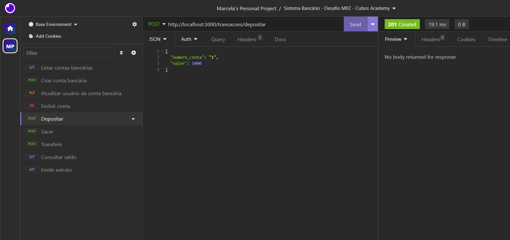
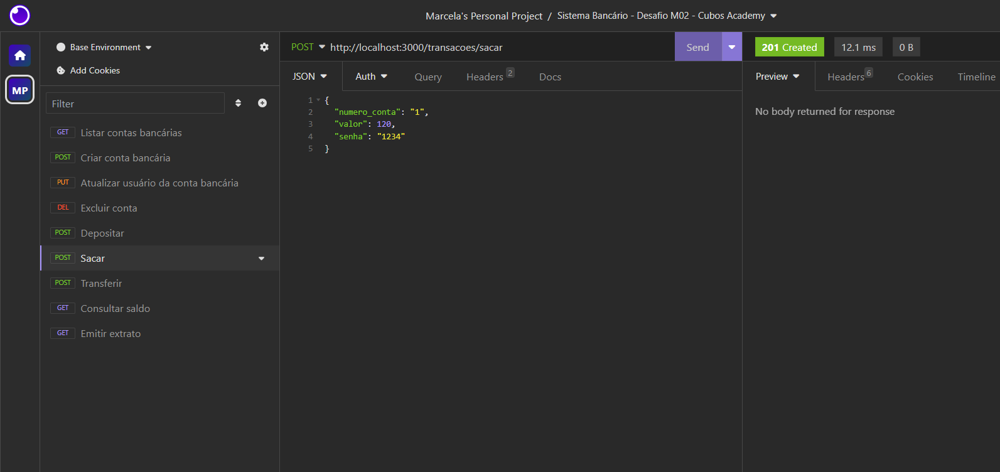
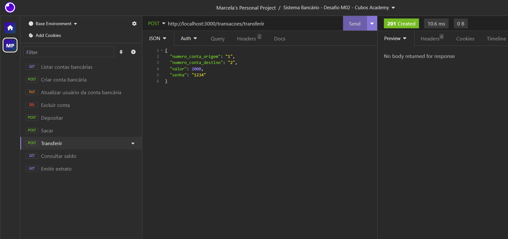

># API-REST-Sistema-Bancario
## 📂 Descrição do projeto
Projeto realizado como Desafio do Módulo 02 do curso de Desenvolvimento de Software com foco em Back-end da Cubos Academy, com o objetivo de nos fornecer a prática na criação do zero de uma API REST.

A API RESTful do Sistema Bancário foi desenvolvida para realizar operações bancárias e cadastrais de um Banco Digital, com imput dos dados através do Body, Query e da URL no framework Insomnia.

## ⚙ Funcionalidades
* Criar conta bancária

* Listar contas bancárias

* Atualizar os dados do usuário da conta bancária

* Excluir uma conta bancária

* Depositar em uma conta bancária

* Sacar de uma conta bancária

* Transferir valores entre contas bancárias

* Consultar saldo da conta bancária

* Emitir extrato bancário

## 🛠 Linguagens e Ferramentas utilizadas


## Executando o projeto

Para começar a utilizar a API REST do Sistema Bancário na sua máquina, siga estas etapas:

```shell
# 1. Faça o Fork do repositório

# 2. Clone o projeto

git clone <um-dos-links-abaixo>

HTTPS:
https://github.com/MarcelaLinhares/API-REST-Sistema-Bancario.git

SSH:
git@github.com:MarcelaLinhares/API-REST-Sistema-Bancario.git

# 3. No VS Code instale as dependências

npm install

# 4. Execute o servidor

npm run dev

```

Para realizar as requisições com os verbos GET, POST, PUT, DELETE use o framework Insomnia ou similar.

Abra o insomnia e use o caminho:
http://localhost:3000/

## Endpoints no Insomnia
- [ ] Criar Conta Bancária - **POST**
```javascript
http://localhost:3000/contas
```
```javascript
// No body (JSON) preencher os dados da requisição:
{
 "nome": "Exemplo",
 "cpf": "00000000000",
 "data_nascimento": "01/01/1991",
 "telefone": "21900000000",
 "email": "exemplo@exemplo.com",
 "senha": "1234"
}
```


- [ ] Listar Contas Bancárias - **GET**
```javascript
http://localhost:3000/contas?senha_banco=Cubos123Bank
```


- [ ] Atualizar Usuário da Conta Bancária - **PUT**
```javascript
http://localhost:3000/contas/:numeroConta/usuario
```
```javascript
// No body (JSON) preencher os dados da requisição:
{
 "nome": "Exemplo",
 "cpf": "00000000000",
 "data_nascimento": "01/01/1991",
 "telefone": "21900000000",
 "email": "exemplo@exemplo.com",
 "senha": "1234"
}
```


- [ ] Excluir Conta Bancária - **DELETE**

```javascript
http://localhost:3000/contas/:numeroConta
```


- [ ] Depositar - **POST**
```javascript
http://localhost:3000/transacoes/depositar
```
```javascript
// No body (JSON) preencher os dados da requisição:
{
 "numero_conta": "1",
 "valor": 5000
}
```



- [ ] Sacar - **POST**
```javascript
http://localhost:3000/transacoes/sacar
```
```javascript
// No body (JSON) preencher os dados da requisição:
{
 "numero_conta": "1",
 "valor": 120,
 "senha": "1234"
}
```



- [ ] Transferir - **POST**
```javascript
http://localhost:3000/transacoes/transferir
```
```javascript
// No body (JSON) preencher os dados da requisição:
{
 "numero_conta_origem": "1",
"numero_conta_destino": "2",
 "valor": 2000,
 "senha": "1234"
}
```



- [ ] Consultar Saldo - **GET**
```javascript
http://localhost:3000/contas/saldo?numero_conta=1&senha=1234
```


- [ ] Emitir Extrato - **GET**
```javascript
http://localhost:3000/contas/extrato?numero_conta=1&senha=1234
```


## Contribua com o Projeto

- [ ] Realize o Fork
- [ ] Faça as modificações
- [ ] Realize o Pull Request (PR)

## Desenvolvedores

<table>
  <tr>
    <td align="center"><a href="https://github.com/MarcelaLinhares"><br /><sub><b>Marcela Linhares</b></sub></a><br /></td>
